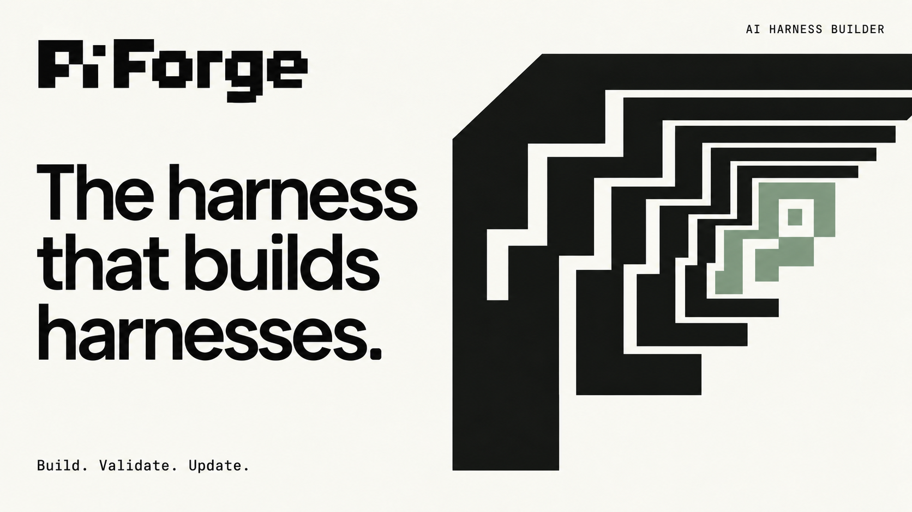

<p align="center">
  
</p>

# pi-Forge

**pi-Forge is an agent harness that builds agent harnesses**, on top of [pi](https://github.com/earendil-works/pi).

Tell it about your work. It interviews you, then generates a custom agent for that work: specialized tools, a system prompt, guardrails, a theme, a logo, and **domain views** (a 3D molecule viewer, charts, tables, a pixel-sprite editor…). Every harness it builds runs:

- in a **browser UI** with your views, a live plan, and file outputs
- in the **terminal**
- **headless** (`-p`, JSON event stream, RPC), for scripts and other apps
- as a **standalone program** you can zip and share (no Node needed)

The command is `forge`.

---

## Quick start

**You need:** [Node.js](https://nodejs.org) 22.18 or newer, [Git](https://git-scm.com) (on Windows, Git for Windows, whose Git Bash the agent uses), and an API key for a model provider. [Bun](https://bun.sh) is optional and only needed to package harnesses as programs.

```bash
git clone https://github.com/djtoon/pi-forge.git
cd pi-forge
npm install
npm run doctor            # checks Node, Git Bash, Bun and your model provider
```

**Set up a model provider**, either way:
- **Environment:** set `ANTHROPIC_API_KEY`, `OPENAI_API_KEY`, `GEMINI_API_KEY`, `OPENROUTER_API_KEY`, or AWS credentials for Bedrock (`AWS_PROFILE`, or `AWS_ACCESS_KEY_ID` + `AWS_SECRET_ACCESS_KEY`, plus `AWS_REGION`).
- **Settings page:** start the web UI and add the key under **Settings → Model providers**. It's saved in `~/.forge/credentials.json` on your machine.

**Start pi-Forge:**

```bash
npm run forge -- web      # browser UI (opens http://127.0.0.1:4317)
npm run forge             # or the terminal UI
```

Then describe what you need, for example *"build me a harness for planning 3D prints"* or *"I want an agent that helps me with chemistry research"*. pi-Forge:
1. asks you a few rounds of questions
2. proposes a toolkit
3. writes the spec, the tools and a logo
4. generates the harness and tests it

Try the bundled example right away:

```bash
npm run chem -- web       # Chem Lab: PubChem tools, 3D molecule views
```

---

## Running a harness

Harnesses live in `harnesses/<name>/`. Each has its own settings and chats in `~/.forge/<name>`.

```bash
node harnesses/<name>/bin/<name>.ts web            # browser UI (add --port N, --no-open)
node harnesses/<name>/bin/<name>.ts                # terminal UI
node harnesses/<name>/bin/<name>.ts -p "question"  # headless: print the answer
node harnesses/<name>/bin/<name>.ts --mode json -p "…"   # headless: JSONL event stream
node harnesses/<name>/bin/<name>.ts --mode rpc     # headless: controlled over stdin/stdout
```

## Packaging a harness as a program

```bash
npm run package -- harnesses/chem                        # for this computer
npm run package -- harnesses/chem --target linux-x64     # windows-x64, windows-arm64, linux-x64, linux-arm64, darwin-x64, darwin-arm64
```

You can also ask pi-Forge to "package chem". The result is `dist/<name>-<target>/`: an executable, the harness and the web UI files. **Zip the folder and share it.** The people you share it with don't need Node or this repo:
- `chem web`, or double-click `chem-web.cmd` on Windows: browser UI
- `chem`: terminal UI
- `chem -p "…"`: headless

Packaging needs Bun.

---

## How it works

```
you ⇄ pi-Forge (interview, plan, tools, views, logo)
          │ writes
          ▼
   harnesses/<name>/harness.yaml  +  custom/   (your tools, views, logo, skills)
          │ generates  (templates/ → generated files, tracked in .forge/manifest.json)
          ▼
   a pi package + launcher  →  browser · terminal · headless · standalone program
```

- **`harness.yaml` is the source of truth.** It holds the model, tools, guardrails, system prompt, theme, welcome text and views. Your editor gets completion from `schema/harness.schema.json`.
- **`custom/` is yours.** Tools go in `custom/extensions/*.ts`, helpers in `custom/lib/`, domain views in `custom/views/`, the logo in `custom/brand/mark.svg`, and skills in `custom/skills/`. The generator never touches this folder.
- **Everything else is generated.** Editing a generated file by hand is detected and refused; change the spec or the template instead.
- **Views:** a tool returns `viewResult(text, viewId, data)`. The model reads `text`. The browser draws the view's `web.js`, the terminal draws its `tui.ts`, and JSON/RPC clients get `data`. Views can also stay pinned in the side card.
- **Plans:** every harness has an `update_plan` tool. For multi-step work, the agent posts a checklist and ticks it off as it goes. You see it beside the chat, or above the input in the terminal.
- **Models:** a spec names a preferred model, used when its provider has credentials on your machine. A Claude model on Bedrock falls back to the same model from Anthropic when you have an Anthropic key. Otherwise pi picks a model from the provider you set up. Switch models any time from the model dropdown.

### A harness spec

```yaml
name: chem
title: Chem Lab
description: Chemistry research assistant with PubChem tools and molecule views
model: { provider: amazon-bedrock, id: global.anthropic.claude-opus-5-5, thinking: medium }
tools:
  builtin: [read, write, edit, bash, grep, find, ls]
  custom: [molecule_lookup, molecule_compare, similar_molecules]
guards:
  protected_paths: [".env", "**/*.key"]
  confirm_bash: ["rm -rf"]
prompt:
  system: |
    You are a chemistry research assistant. Use molecule_lookup for any specific compound…
ui:
  theme: { name: chem, base: dark, accent: "okhsl(175 60% 66%)" }
  web:
    headline: "What are we researching today?"
    placeholder: "Ask about a molecule, a comparison, or analogs..."
  views:
    - { id: molecule, shows: [molecule_lookup], panel: right }
    - { id: data-table, shows: [molecule_compare, similar_molecules] }
```

### pi-Forge's tools

| Tool | What it does |
|---|---|
| `forge_ask` | Asks you questions in a step-by-step form: checkboxes, "select all", back/next |
| `forge_init` | Creates `harnesses/<name>/` with a starter spec |
| `forge_list` | Lists harnesses, views, themes and header art |
| `forge_validate` | Checks a spec and reports each problem with its exact path |
| `forge_generate` | Shows the planned changes (dry run), then applies them |
| `forge_smoke` | A free check that the harness loads, plus an optional live prompt |
| `forge_check_view` | Checks a view and renders its sample at several widths |
| `forge_promote_view` | Moves a custom view into `templates/views/` so every harness can use it |
| `forge_package` | Builds a standalone program from a harness |

Its skills are `harness-interview`, `harness-update`, `tool-builder` and `view-builder`, in `forge/custom/skills/`.

---

## Commands

| Command | Does |
|---|---|
| `npm run doctor` | Checks that your machine is ready |
| `npm run forge [-- web]` | Starts pi-Forge |
| `npm run chem [-- web]` | Starts the example harness |
| `npm run gen -- harnesses/<name> [--apply] [--diff]` | Regenerates one harness from its spec |
| `npm run upgrade [-- --pi <version>] [--apply] [--live]` | Updates pi, regenerates all harnesses, type-checks and smoke-tests them |
| `npm run package -- harnesses/<name> [--target …]` | Builds a standalone program |
| `npm run check` | Type-checks everything |
| `npm run verify` | Type check, generator dry run and load checks (what CI runs) |

## Project layout

```
packages/harness-core   launcher: spec → ~/.forge/<name> → pi (all modes) or the web UI
packages/harness-spec   harness.yaml schema and validation
packages/harness-web    browser UI and local server (chats, views, plan, settings, provider keys)
packages/forge-gen      generator, smoke tests, view checker, packager
templates/              views, plan tool, guards, header, art, tool templates
forge/                  pi-Forge itself, a harness like any other
harnesses/chem          example: chemistry research (PubChem, 3D molecules)
harnesses/loan-calc     example: loan schedules and comparisons (charts)
docs/                   architecture notes and images
```

Harnesses you build are listed in `.gitignore`, so they stay local unless you choose to commit them.

## Troubleshooting

- **"No model" or auth errors:** run `npm run doctor`, then add a key in Settings or set the environment variable. Check the model dropdown in the message box.
- **Windows: the agent can't run shell commands:** install Git for Windows. pi uses its Git Bash.
- **A harness won't start after you edit its tools:** ask pi-Forge to `forge_smoke` it. The load check names the file and line.
- **Port in use:** `… web --port 4400`. The server also tries the next free port on its own.
- **A generated file was "edited by hand":** move your change into `custom/` or `harness.yaml`, then regenerate.

## Security

Agents run with your user's permissions: they can read and write files and run commands. Guardrails (`guards:` in the spec) ask before writing protected files or running listed commands, and block them when there's no one to ask. The web UI listens only on `127.0.0.1` and needs a per-run token. Provider keys stay on your machine, and the browser only ever sees masked previews. See [SECURITY.md](SECURITY.md).

## Contributing

Issues and pull requests are welcome. See [CONTRIBUTING.md](CONTRIBUTING.md) and [docs/architecture.md](docs/architecture.md).

## License and credits

MIT, see [LICENSE](LICENSE). pi-Forge is built on **[pi](https://github.com/earendil-works/pi)** by Mario Zechner and Earendil Works (MIT). Icons are from the AI Icon Pack (MIT). See [THIRD_PARTY_NOTICES.md](THIRD_PARTY_NOTICES.md).
